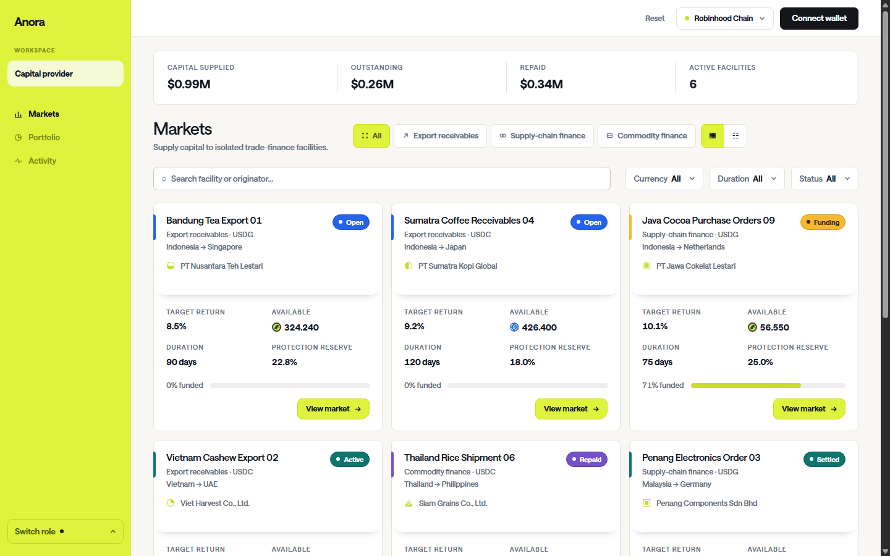
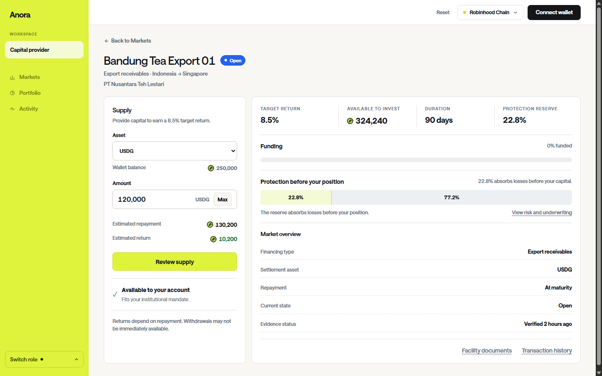
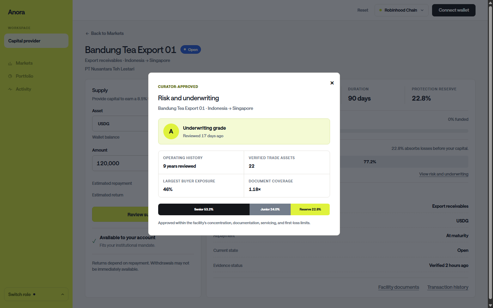
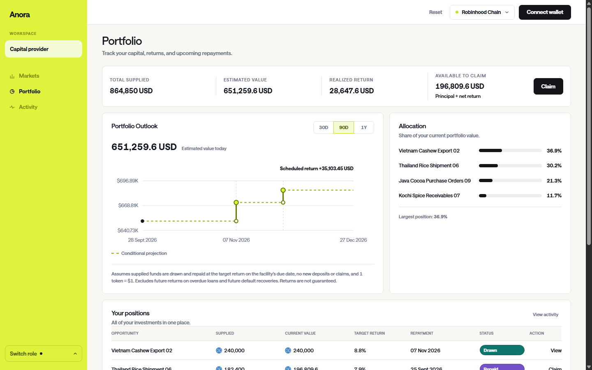
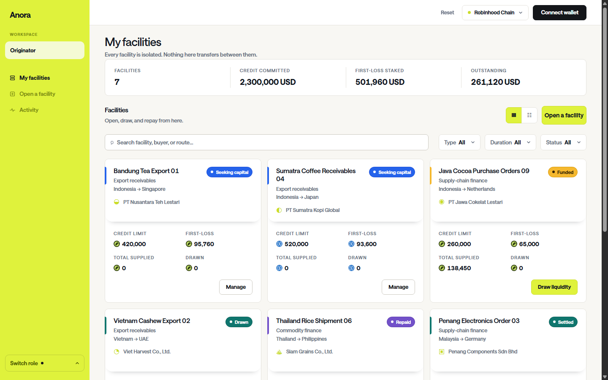
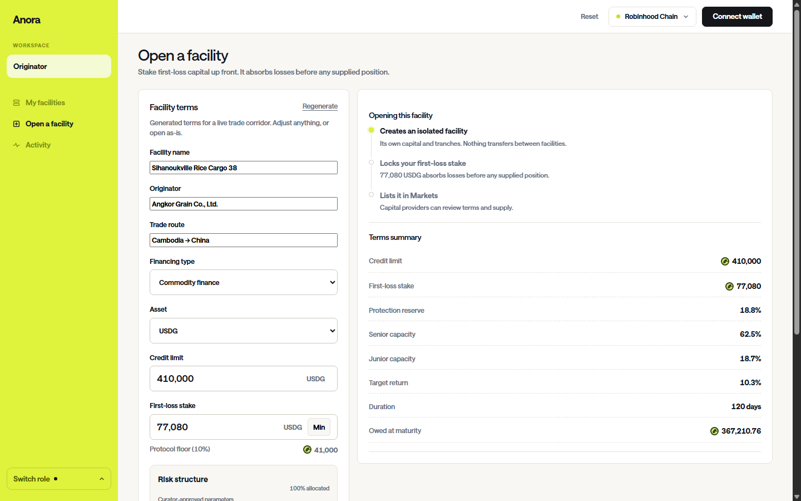

# Anora

**Bringing trade-backed yield onchain, uncorrelated with crypto markets.**

[Live demo](https://anora.finance)

Anora is a PayFi (Payment Finance) protocol building onchain rails between
global capital and the real economy. Through isolated, programmable vaults,
Anora connects capital to vetted trade-credit opportunities and provides
transparent access to yield generated by real commercial activity. Each
facility has its own terms, tranche structure, originator first-loss reserve,
and repayment lifecycle — keeping risk contained within that facility.


## Traditional Pooled PayFi vs Anora

Some PayFi products aggregate multiple credit opportunities into one managed
portfolio. Anora gives capital providers direct, facility-level choice.

```text
Pooled PayFi model                         Anora
━━━━━━━━━━━━━━━━━━━━━━━━━━━━━              ━━━━━━━━━━━━━━━━━━━━━━━━━━━━━

Capital providers                          Capital provider
[Provider]  [Provider]                     [Provider]
     │          │                               │
     └────┬─────┘                               │ chooses
          │                              ┌───────┼────────┐
     ┌────▼────┐                         │       │        │
     │ Shared  │                     ┌───▼───┐ ┌─▼─────┐ ┌▼──────┐
     │ PayFi   │                     │Facility│ │Facility│ │Facility│
     │ vault   │                     │   A    │ │   B    │ │   C   │
     │  ($$)   │                     │  ($$)  │ │  ($$)  │ │  ($$) │
     └────┬────┘                     └───┬────┘ └──┬────┘ └──┬────┘
          │                              │         │          │
   ┌──────┼──────┐                  [Originator] [Originator] [Originator]
   │      │      │                       │          │          │
[Trade A][Trade B][Trade C]           [Trade A]  [Trade B]  [Trade C]
```

| Pooled PayFi model | Anora |
|---|---|
| Capital is allocated across a managed portfolio. | Capital providers choose individual facilities. |
| Facility performance is blended into one portfolio value. | Each facility has its own capital, terms, and outcome. |
| Providers inherit the portfolio's combined exposure. | Providers review facility-specific risk before supplying. |
| Protection depends on the pooled vehicle's structure. | Each facility has Senior and Junior tranches plus an originator first-loss reserve. |


## Product features

<table>
  <tr>
    <td width="50%">
      <br>
      <strong>Explore isolated trade-credit opportunities</strong>
    </td>
    <td width="50%">
      <br>
      <strong>Review every facility before funding</strong>
    </td>
  </tr>
  <tr>
    <td width="50%">
      <br>
      <strong>See risk, underwriting, and protection</strong>
    </td>
    <td width="50%">
      <br>
      <strong>Track positions and repayment outlook</strong>
    </td>
  </tr>
  <tr>
    <td width="50%">
      <br>
      <strong>Manage every facility independently</strong>
    </td>
    <td width="50%">
      <br>
      <strong>Create programmable trade-credit facilities</strong>
    </td>
  </tr>
</table>

Built for the Arbitrum Open House Singapore 2026 buildathon. Target chain:
Arbitrum Sepolia.

| Contract | Robinhood Chain (mainnet, USDG) |
|---|---|
| AnoraFactory | [`0x9a01C5E22602E565d39067454dD70c38D063D328`](https://robinhoodchain.blockscout.com/address/0x9a01C5E22602E565d39067454dD70c38D063D328) |
| AnoraFacility (implementation) | [`0x8695a1C6AD462DFc7a6cb7980dB99D9Eb1c26F6f`](https://robinhoodchain.blockscout.com/address/0x8695a1C6AD462DFc7a6cb7980dB99D9Eb1c26F6f) |
| USDG | [`0x5fc5360D0400a0Fd4f2af552ADD042D716F1d168`](https://robinhoodchain.blockscout.com/address/0x5fc5360D0400a0Fd4f2af552ADD042D716F1d168) |

| Contract | Arbitrum Sepolia |
|---|---|
| AnoraFactory | [`0xDD4977E7D6249d0c5035Ed55DB1c710Fec4E9707`](https://sepolia.arbiscan.io/address/0xDD4977E7D6249d0c5035Ed55DB1c710Fec4E9707) |
| AnoraFacility (implementation) | [`0x58D4b3A476Bf7033661277432b0B96716011a02f`](https://sepolia.arbiscan.io/address/0x58D4b3A476Bf7033661277432b0B96716011a02f) |
| TestUSDC | [`0x38513243bA873d05b8b1E6622fE12e7685E4eAc6`](https://sepolia.arbiscan.io/address/0x38513243bA873d05b8b1E6622fE12e7685E4eAc6) |

Monorepo, Bun workspaces.

```
contracts/   Foundry: AnoraFactory, AnoraFacility, tests, deploy script
apps/        web and api (coming)
packages/    shared code (coming)
```

```
bun install
bun run test:contracts
```

## apps/web

Live demo build: https://anora.finance (redeploy with `bin/deploy-web.sh`).

Vite + React + TypeScript with plain CSS and no UI framework. The latest
routed capital-provider and originator experience is the approved product
demo and currently runs through `DemoProvider` in `apps/web/src/App.tsx`.
Wallet configuration, deployment resolution, wagmi/viem hooks, and older live
contract components remain in the repository for integration, but they are
not yet the data source behind the latest screens.

```
bun run dev:web      # http://127.0.0.1:5173
bun run build:web     # type-checks then builds apps/web/dist
bun run test:web      # vitest: waterfall math, facility figures, route parsing, formatting, deployments map
```

### Factory model

The protocol is one `AnoraFactory` per chain opening isolated `AnoraFacility`
clones (`Clones.clone`), not a single shared pool. Each facility has its own
Senior/Junior capital, first-loss stake, drawdown, and late/default/recovery
waterfall; a default in one facility never touches another. The factory holds
the protocol-level `riskAgent()` and `minFirstLossBps()` floor; every facility
reads `riskAgent()` back from its factory rather than storing its own.

### Pages

| Route | Page | What it does |
|---|---|---|
| `#home` | Homepage | Explains the product and routes users into capital-provider or originator workflows. |
| `#markets` | Markets | Compares isolated facilities using synchronized demo terms, capacity, protection, and status. |
| `#opportunity` | Facility detail | Reviews a selected facility, its underwriting and documents, then simulates approval and supply. |
| `#portfolio` | Portfolio | Derives supplied positions, allocation, repayment dates, and projections from the same demo facility records. |
| `#activity` | Activity | Presents role-aware lifecycle events generated by demo interactions. |
| `#facilities` | Originator facilities | Lists facilities managed by the approved originator and exposes lifecycle-specific actions. |
| `#open-facility` | Open a facility | Creates editable terms, tranche proportions, provider capacity, and first-loss reserve in demo state. |
| `#facility` | Facility management | Operates drawdown, repayment, default, and recovery against the selected demo facility. |

The production integration must replace `DemoProvider` behind these screens
with canonical contract reads, transactions, indexing, and approved metadata.
It must not silently fall back to demo data when a live integration fails.

### Supported networks

| Network | Chain ID | Asset | Faucet |
|---|---|---|---|
| Arbitrum Sepolia | 421614 | TestUSDC | yes, `mint(address,uint256)` |
| Robinhood Chain | 4663 | USDG | no |

`contracts/deployments.json` is the single source of truth for both networks:
factory address, asset address and symbol, whether the asset has a public
faucet, and the block explorer base URL. `apps/web/src/config/deployments.ts`
imports that file directly (`resolveJsonModule`) and exposes
`deploymentFor(chainId)`; nothing about a network is hardcoded in the UI
beyond the chain definitions in `apps/web/src/config/wagmi.ts`. The header's
network selector calls `switchChain`, and every read/write hook pulls its
factory/asset address from `useDeployment()`
(`apps/web/src/hooks/useDeployment.ts`), keyed by the connected `chainId` so
switching networks never shows stale data. A chain missing from the file
shows a "not supported" card with a chain switcher instead of the app.

ABIs are generated, not hand-written: `bun scripts/export-abi.ts` reads
`contracts/out/{AnoraFactory,AnoraFacility,TestUSDC}.sol/*.json` (run
`forge build` in `contracts/` first) and writes `apps/web/src/abi/*.ts` as
`as const` arrays. Re-run it whenever a contract's interface changes, and
commit the output. The generated `TestUSDCAbi` is a plain ERC-20 subset
(balanceOf, allowance, approve, mint) reused for USDG on Robinhood Chain; the
mint button only renders when the active network's `faucet` flag is true.

**Tenor-in-minutes demo convention**: `AnoraFacility.Terms.tenor` and
`.grace` are seconds onchain, but Arbitrum Sepolia is a live network we
cannot warp time on. The Originate form takes both in **minutes** and
multiplies by 60 before sending the transaction, so a demo facility can go
from Open to markLate-eligible, then default-eligible, in a couple of minutes
instead of days. `apps/web/scripts/smoke-vbrowser.mjs` drives this whole
lifecycle end to end (connect, originate, deposit both tranches, drawdown,
mark late, declare default, record recovery, withdraw) against a real VPS
Chrome window with an injected wallet; see its header for the env vars
(`SMOKE_CHAIN`, `SMOKE_UNIT`, `SMOKE_TENOR_MIN`, `SMOKE_GRACE_MIN`,
`SMOKE_RESUME`, `SMOKE_SHOTS`).


## Contract quality

- OpenZeppelin 5.7: `Clones` for facilities, `SafeERC20`, `ReentrancyGuard`, `Initializable`, `Ownable2Step`, `Pausable`.
- 26 Foundry tests including a fuzz test that checks the waterfall never creates or loses capital (`testFuzz_waterfallConservesCapital`).
- Slither (`uvx --from slither-analyzer slither . --filter-paths "lib/|test/|script/"`) reports no high or medium findings. Remaining informational items are intentional: late fees accrue per whole day (`divide-before-multiply`), and due dates, grace periods and late fees are timestamp based by design (`timestamp`).

## apps/keeper

Permissionless watcher. It subscribes to `Drawn` events over Alchemy websockets on Robinhood Chain and Arbitrum Sepolia and schedules a `markLate()` call for the exact due timestamp; a one-minute poll over every facility in `contracts/deployments.json` is the fallback. Late status itself is derived onchain from timestamps; the keeper only makes sure somebody calls the permissionless function. Anyone can call `markLate`, so the keeper holds no privilege; it only makes sure nobody has to. Runs on the VPS as the `anora-keeper` systemd user unit; `bun run test:keeper` covers the selection rule.

```
KEEPER_PRIVATE_KEY=0x... bun run keeper
```
